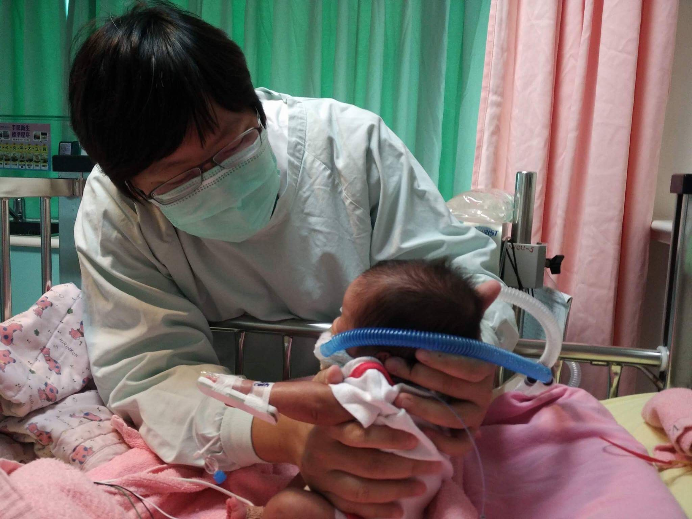

# 現任

* [臺大醫院物理治療中心](https://www.ntuh.gov.tw/PTC/Fpage.action?muid=3&fid=1222)物理治療師  
* [台灣大學物理治療學系](https://www.mc.ntu.edu.tw/ntupt/Index.action)系聘臨床物理治療指導教師  
* 長庚大學物理治療學系系聘臨床物理治療指導教師  

# 學歷
* 台灣大學物理治療研究所碩士  
* 台灣大學物理治療學系學士  

# 經歷
* 台灣大學物理治療學系專任研究助理  
* 亞東醫院放射腫瘤科兼任研究助理  
* 台灣物理治療學會期刊執行編輯  
* 高雄醫學大學物理治療學系系聘臨床物理治療指導教師  
* 2018「世界物理治療聯盟與臺灣物理治療學會之南亞兒童健康國際合作計畫」課程規劃負責人及講師  
* 台灣物理治療學會「高危險新生兒跨領域照護人員培訓課程及工作坊」課程規劃負責人及講師

# 版品、期刊論文
1. 楊佩瑜。早產兒的物理治療。胡名霞、曹昭懿編著：[物理治療臨床案例](https://www.govbooks.com.tw/books/111672)。
