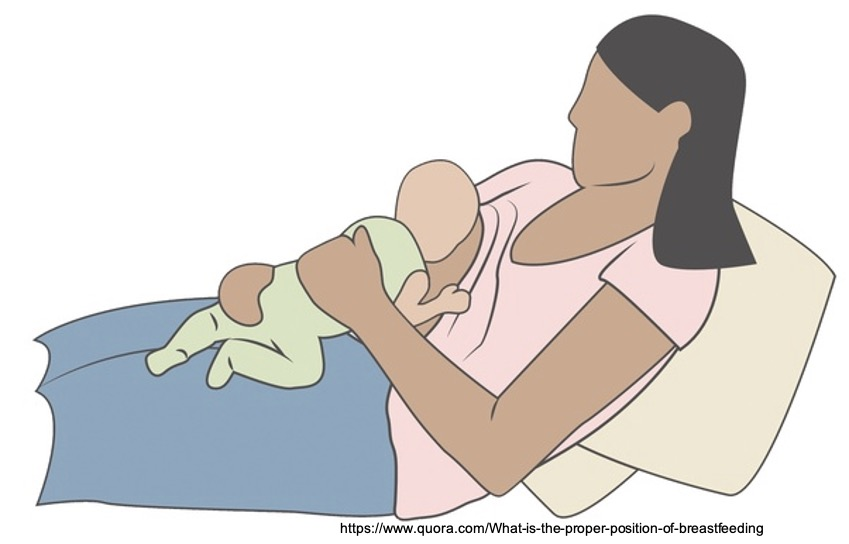

  
  生物哺育法（biological nurturing, BN），又可以稱作生物滋養法，是英國學者Suzanne Colson在2005年經過觀察研究而發表的一種哺乳方式。生物哺育法是一種由母親出發，促進寶寶神經行為的哺育方式，目的在於減少含乳時的困難，降低未預期的終止哺乳。生物哺育法不僅僅是母乳哺育的方式，更可視為肌膚接觸的延伸，認為應根據母親意願，進行不限時間、不限次數、越多肌膚接觸越好的一個過程。
  
>  生物哺育法是一種由母親出發，促進寶寶神經行為的哺育方式
 
  生物哺育法相信並鼓勵激發嬰兒的尋乳本能，事實上Suzanne的研究也發現，當使用生物哺育法哺餵時，可觀察到寶寶釋放多達20種原始反射，顯著多於傳統的哺餵方式！Suzanne認為，和其他哺乳類動物一樣，人類也是一種腹側進食者（abdominal feeder，相對於dorsal feeder）(~~這個翻譯參考就好……我找不到比較好的翻譯……~~)，也會展現許多抗重力的原始反射來幫助含乳。

生物哺育法的六大要素包括：*母親姿勢、母親賀爾蒙狀態、母體本能的親餵行為、寶寶姿勢、寶寶狀態以及新生兒的原始反射*。因此，在進行生物哺育法時，母親與寶寶都不應該受到太多干擾，醫療照顧者也不應過度介入，寶寶的即時反應才是母親的唯一指引。

進行生物哺育法時，母親後躺約15~64度，確保母親的身體及手臂等處都有妥善的得到支托。寶寶趴上媽媽的胸前，如此一來寶寶身體的每個部分都能面對、觸碰並且順著媽媽的身體曲線緊密貼合。不要把寶寶直接「放」到乳房上，通常寶寶會自己利用各種原始反射尋找並含上乳房，此時母親只要適時的給予支托及安撫，確保寶寶處在相對安定、平穩的狀態，以利原始反射的展現即可。[點擊觀看生物哺育法影片](https://www.youtube.com/watch?v=KWj_fXUe2sg)

<!-- blank line -->
<figure class="video_container">
  <iframe src="https://www.youtube.com/watch?v=KWj_fXUe2sg" frameborder="0" allowfullscreen="true"> </iframe>
</figure>
<!-- blank line -->

在臨床上，對於口腔穩定度不佳的初生嬰兒，生物哺育法常可以成功的幫助母乳哺育。以生物力學的角度來看，生物哺育法由於有重力的協助，可使寶寶的下巴更貼近乳房，也可幫助寶寶舌頭因免於對抗地心引力的影響而使動作更容易，對於部分下巴後縮或舌頭後倒的寶寶來說，更能有效地含乳。此外，對於部分對奶水流速較敏感的寶寶而言，生物哺育法較可以讓寶寶有餘裕好好處理口腔內的乳汁，避免奶陣來時，一大口乳汁直接衝進口腔內造成嗆咳。

在這邊要提醒各位讀者的是，由於生物哺育法強調的是原始反射與本能，因此對於月齡較大的孩子，可能不一定適用。**若有哺乳困難的問題，建議一定要尋求泌乳顧問的協助，唯有完整的評估母嬰狀況及哺餵情形，才可真正找到問題所在，解決哺乳問題！**

