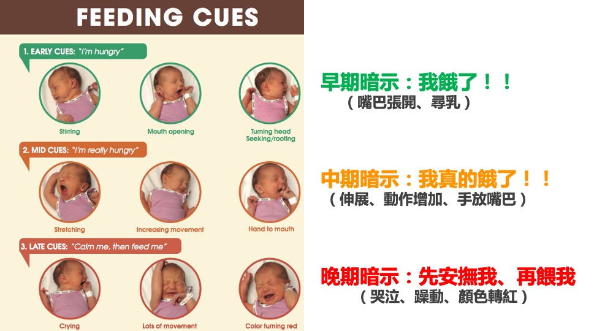

# 母乳對早產寶寶的重要性

  母奶是早產寶寶很重要的營養與免疫來源。研究證實，喝母奶的寶寶發生致命性感染的比例較低、得到壞死性腸炎的機率較低、腦部發育較好且長大後的智商較高，出院後也比較不容易因為感染重複進出醫院！事實上，母奶裡有600多種活性物質，除了可以刺激腸胃道發育外，裡面豐富的抗體也是寶寶對抗感染的最佳武器，這是配方奶做不到的！  
  
  在NICU工作一陣子後，總會遇到一些家長問我說  
  
  *「老師，寶寶現在會吃了，我們回家可以親餵嗎？」*
  
  *「老師，寶寶不太喜歡冷凍母奶，我有可能直接親餵寶寶嗎？」*

  面對這個問題，坦白說很難直接用「可以」或是「不可以」這種兩分法來回答。  
  每個孩子以及家庭的狀況都不一樣。因此，在我更了解母乳哺育之後，我的回答往往是「**親餵需要練習，如同當初寶寶學習瓶餵一樣。我支持媽媽這樣的想法及目標，我們可以一起試著練習看看。**」  

# 在練習親餵之前，我可以...  
+ **持續擠奶，維持奶量**  

  在可以親自哺餵寶寶之前，媽媽可以透過以下方式擠乳：  

  1. 初期可使用手擠奶，當奶量逐漸增加後，可改用電動擠乳器搭配手擠奶，也可租借使用電動雙邊擠乳器使用。  
  2. 擠奶頻率：白天至少每4小時擠奶一次，夜間至少1次。若感覺乳房有腫脹感，則可以縮短至3小時擠奶一次。 
  3.  **擠奶次數比時間重要！** 每次每邊擠15-20分鐘即可。 
        
           
+ **執行袋鼠式照護（肌膚接觸）**  

  [袋鼠護理](https://ptpeiyuyang.netlify.app/blog/2020-06-16-kangaroo-care-2/)對早產寶寶有很多好處，包括增加寶寶心跳、呼吸及體溫的穩定性，增加體重生長、安撫寶寶、增加媽媽泌乳量、建立親子的依附及連結以及促進親餵。  

  1. 若寶寶仍在住院中，鼓勵家長充分和照顧寶寶的醫護人員溝通。 
  2. 執行袋鼠式照護時，可穿著前開式的襯衫前往探視寶寶，方便您和寶寶的接觸 
  3. 若情況許可，建議每天執行一小時。爸爸也可以執行袋鼠式照護喔！ 
  4. 若寶寶已經出院回家，可在寶寶準備進食前一小時執行，待寶寶醒來後，便可直接嘗試餵食囉！ 

# 親餵練習三部曲  

+ **讀懂寶寶的表現-飢餓暗示**  
  當寶寶出現以下表現時，代表他/她已經準備好要開始練習親餵囉！  

    1. 頭前後擺動  
    2. 吸吮或吐出他的舌頭  
    3. 出現舔嘴唇的動作  
    4. 把手放到嘴巴裡吃  

  
+ **非營養性吸吮練習**  

  非營養性吸吮指的是在吸吮的過程中，寶寶不會得到任何乳汁。由於寶寶還在練習階段，為免寶寶被突如其來的奶陣嚇到，您可以擠乳排空乳房後，再讓寶寶直接在您的乳房上練習吸吮。 

+ **親餵練習**  

  當寶寶已經可以正確含乳，並作出有效的吸吮動作後，您與寶寶就可以開始嘗試親餵了！您可能會擔心寶寶沒有真的吃到奶水，但別擔心，初期讓寶寶練習並且有好的乳房經驗比吃到多少奶水更重要。
若出現下列表現，代表寶寶真的有成功吃到囉！  

  1. 看見寶寶的下顎有動作，且看見或聽見寶寶吞嚥。  
  2. 在寶寶的口腔內可看見乳汁。  
  3. 在親餵之後，寶寶是很平靜且放鬆的，且在餵食結束之後可小睡一會兒。 
  4. 餵食後，您的乳房感覺鬆軟，且擠奶量比平時要少。 
  
  
  若嘗試了20分鐘但寶寶看起來對親餵沒興趣時，可以先讓寶寶以瓶餵或管餵完成該餐。  
  您則繼續擠奶以維持奶量。慢慢練習，寶寶會越來越進步的！  
  
  困難餵食的寶寶需要專業的支持與陪伴，若有需求，建議尋求各地泌乳顧問諮詢喔！  

