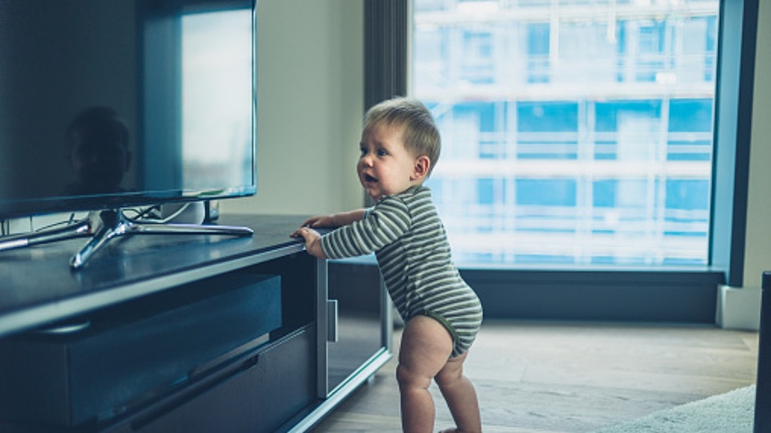

在發展評估門診，偶爾會有家長問我  
*「老師，我可以給寶寶坐學步車嗎？」* 或是  
*「老師，我看到有些育兒文章反對學步車的使用，可是我小時候也常常被放在學步車裡面，現在也是好好的！真的不能坐嗎？」*    
針對這個問題，我多半會詢問家長，想給寶寶學步車的理由是什麼？  
得到的答案不外乎「*這樣我做事比較方便*」、「*寶寶放學步車上有得玩比較不會吵*」或是「*這樣學走路比較快*」等等。  
**可是，學步車真的可以滿足家長的這些期待嗎？**
  
# 使用學步車真的可以學會走路？    
一般市售常見的學步車有兩種，一種是讓寶寶可以坐在車上移動的「螃蟹車」，一種則是讓寶寶推著走路的「學步推車」，這邊討論的主要是螃蟹車。  
雖然有多篇研究探討學步車和寶寶發展的相關性，但目前似乎沒有比較大規模且嚴謹的實證證據。  
然而，根據一篇2020年發表的研究結果顯示，**有沒有使用學步車並不會影響寶寶學會走路的時間**（也就是說，使用學步車的寶寶沒有比較快學會走路！！）；但使用學步車的寶寶，其走路的模式卻和沒有使用學步車的寶寶不一樣。  
事實上，觀察坐在學步車裡的寶寶也可以發現，寶寶移動時主要靠著雙腳的推蹬前進，而且身體重心也會往前傾，和一般正常走路時的跨步和重心轉移完全不一樣。另外，若寶寶還沒有足夠的力氣站立或被放在高度不適當的學步車內，反而可能讓寶寶發展出不適當的站立姿勢（比如顛腳尖）或限制寶寶的雙腳承重機會。因此，**從動作發展的角度來看，若想讓寶寶儘早學會走路，學步車可能不是一個好選擇。**  
  
  > 移動學步車的出力方式和正常走路的模式不相同，因此使用學步車並不會讓寶寶比較快學會走路。

# 學步車引起的傷害？  
根據知名期刊「Pediatrics」在2018年發表的文章，美國從1990~2014年間共有23萬名以上的嬰幼兒發生學步車相關的傷害。受傷的原因以跌落樓梯最多(74.1%)，其他還包括摔出學步車、燒燙傷、中毒等。其中，有90%的嬰幼兒產生頭頸部傷害，而因學步車傷害造成的住院病童內，有37.8%的嬰幼兒有頭骨骨折。**目前美國兒科醫學會已經公開呼籲停止使用及販售學步車，加拿大則已經全部禁止販售與製造學步車。**   臨床上，我也確實看過因坐學步車移動而不小心燙傷的例子….(我自己的朋友更是有坐在學步車內被哥哥撞到摔下樓梯的悲慘案例……因此，**學步車造成的傷害絕對不是運氣的問題，而是一個可避免的傷害。**  
    

  
寶寶的發展需要適當刺激與陪伴，若是想要讓寶寶練習行走，適當高度的茶几（尖銳的轉角也必須小心）、沙發、圍欄或是放有重物的箱子等，都可以當作寶寶走路時的支撐物，最大的前提是**全程需有大人在旁保護以及協助**。若真的想要使用寶寶推車，也提醒大人必須全程陪同，而對於剛開始練習的寶寶，也建議大人稍微壓著車子，以免寶寶重心不穩暴衝或是因為用力過猛而跌倒受傷。  
**若寶寶有發展上的疑慮，建議家長尋求物理治療師或相關專業的評估及協助喔！**    
    
參考資料：  
1. Infant Walker-Related Injuries in the United States. Ariel Sims, Thitphalak Chounthirath, Jingzhen Yang, Nichole L Hodges, Gary A Smith. Pediatrics, 2018.  
2. Effects of baby walker use on the development of gait by typically developing toddlers. Paula S C Chagas, Sergio T Fonseca, Thiago R T Santos, Thales R Souza, Luiz Megale, Paula L Silva, Marisa C Mancini. Gait and Posture, 2020.

