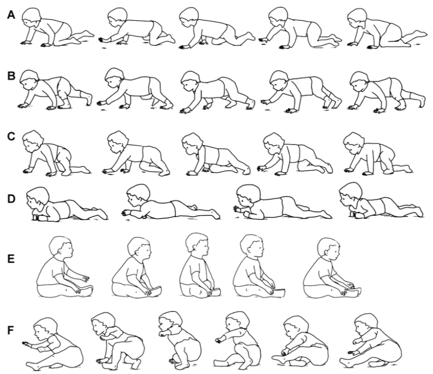

對多數家長來說，當寶寶學會往前爬，搗蛋的技能就像往上一個檔次，可以說是既開心又擔心。    在門診諮詢的經驗中，也發現華人家長對於「爬」好像特別情有獨鍾，對於寶寶爬行這件事，也充滿了各種獵奇的都市傳說（笑）。  
今天，我們就來談談「嬰兒爬行」。  
  
# 嬰兒一定要會爬才能走？  
曾經有家長問道，  
*「我的寶寶才剛學會爬沒幾天就想站了，這樣是不是對脊椎不好？」*  
*「我的寶寶扶著東西站得很好，還可以左右移一兩步，可是就是不爬。這樣是不是有什麼問題？」*    
*「長輩說讓寶寶多爬比較好，可是我的寶寶一直想站起來怎麼辦？」*  
從國健署的兒童發展連續圖中，我們可以看到，寶寶移行能力的發展是從翻身開始、經過爬行、扶著傢俱側走，到可以自己獨立行走五步以上（當發展到這個能力，在臨床上就是我們定義的獨立行走了）。事實上，臨床上觀察到的爬行姿態百百種，沒有完全遵循這樣順序發展的寶寶亦不在少數。2011年一篇研究文章中提到，多數寶寶的爬行（這邊提到的爬行是肚子離地小狗爬）和扶著傢俱側走能力出現在能獨立行走之前，然而，爬行與扶著傢俱側走的先後順序則多有變化（73.5%的寶寶是先會爬行才會側走，9.2%的寶寶相反，另外17.3%的寶寶兩者出現相差不到2週）。  其他篇文獻也曾提到，有約10%的寶寶是沒有經過爬行階段就直接站與行走的！(Dev Med Child Neurol.1989;31:25-34.)    
由此可知，**是不是先爬行其實是不影響行走能力的。**  
  
  > 目前沒有證據證實爬行與發展的相關性。  
  
至於是不是多爬比較好，目前並沒有相關研究證實爬行與發展的相關性（我自己想了一下….是也不知道這樣的研究要怎麼設計啦…）。對物理治療師來說，爬和行走（無論是扶著傢俱側走還是獨立行走）都是移行的一種方式，對寶寶的探索及發展都有幫助。行走所需要的肌肉力量、協調與平衡能力，也不亞於爬行所需要的。有研究也發現，爬行的寶寶和能行走的寶寶接收到的語言刺激不太相同。  
因此，**若環境安全許可，並不需要刻意制止寶寶的站立與行走，順其自然就好。**（除了參加寶寶爬行比賽可能得不到獎品跟失去資格之外，我想不到不爬有什麼壞處……）  
  
# 我的寶寶很會爬，可是爬行動作怪怪的，有關係嗎？  
觀察寶寶就可以發現，寶寶在行走前會出現的爬行姿勢種類豐富(如下圖A~F），有肚子貼著地板匍匐前進的、有像小狗用手掌和膝蓋撐地爬的、有像熊用手掌腳掌撐地爬的、也有用屁股坐著前進的，我個人看過最佩服的是雙膝跪著走遍全場的（對該寶寶的核心致敬！XD）。   一篇2013年的研究報告顯示，雖然大多數的寶寶在行走前的移行策略還是採用手掌和膝蓋著地的小狗爬姿（84.5%），但用屁股走路（7.1%）和採用其他爬行策略的寶寶（8.4%）也不是少數。這篇研究也發現，除了用屁股走路的寶寶比採用小狗爬姿的寶寶大約晚一個月學會行走之外，其他爬行姿勢並不影響寶寶行走的時程。確實，**某些異常姿勢可能會與神經性問題有關，遇到這種狀況則必須就醫尋求專業的評估與協助。**  

  
  > 創造適合寶寶發展的環境比怎麼移動來得重要。  
  
如前所述，爬行是寶寶移動的能力之一。從過去的研究看來，有沒有爬行對行走能力的影響不大。  從物理治療的觀點而言，探索環境的動機才是動作發展的基礎。若引起寶寶興趣的物品是需要寶寶採用爬行方式才能互動的（比如說會走的小車車、滾動中的小球等），那寶寶爬行的意願就會大幅提升。反之，若引起寶寶興趣的都是需要將身體直立起來才能接近的（比如說圍欄外的大人、桌子上的食物、沙發上的玩具或是窗台外的小鳥等），那寶寶排除萬難站起來似乎也是可以理解的事情。  
**提醒讀者，文章內所述前提都是寶寶沒有任何神經性異常的狀況，若您發現寶寶有異常或有任何擔心，最佳解法都是帶去醫療院所，尋求專業的評估建議與協助，才能讓寶寶的發展更順利喔！**  
  
參考文獻：  
1. Karen E Adolph, Sarah E Berger, Andrew J Leo. Developmental continuity? Crawling, cruising, and walking. Dev Sci.2011;14:306-18.  
2. Gunfrid V Størvold, K Aarethun, Grete H Bratberg. Age for onset of walking and prewalking strategies. Early Hum Dev.2013;89:655-9.  
  
圖片來源：
Susan K Patrick, J Adam Noah, Jaynie F Yang. Developmental constraints of quadrupedal coordination across crawling styles in human infants. J Neurophysiol.2012;107:3050-61.

