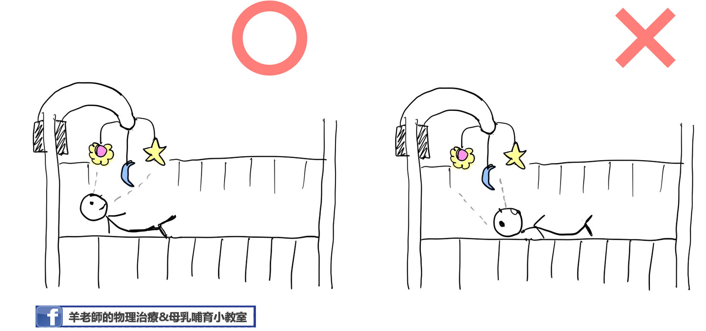
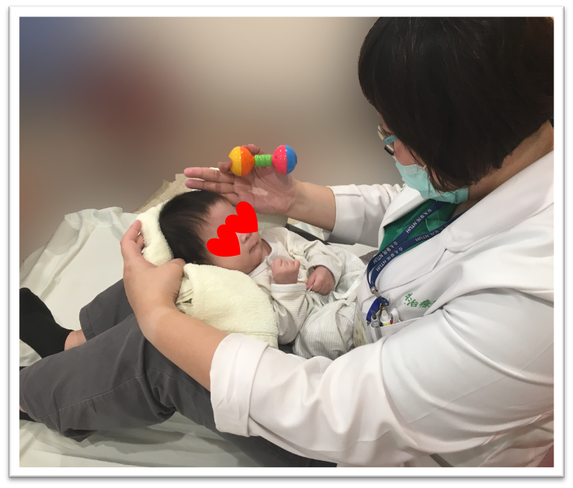

  以兒童粗大動作發展的角度來看，3個月大左右的寶寶通常已經有相當程度的頭部控制，意指寶寶大部分時間可以維持頭部在身體中線，當被抱直起來的時候大人也不需要一直扶著寶寶的頭，趴著玩時能把頭抬高到90度。但是，有部分的3-4個月大的寶寶，當大人拉著寶寶的手從躺著要坐起來時，寶寶的頭會持續掉在身體後方而無法跟上，這種情況我們稱為Head lag（找不到比較適合的中文翻譯……）。  
  >  3個月大的寶寶通常已經有相當程度的頭部控制能力。  
  
  造成Head lag的原因很多，包括早產、腦部損傷、肌張力異常、出生體重過低、新生兒時期有密集性使用過呼吸器等因素；也有研究認為，感覺功能異常的寶寶也會有head lag 的現象，主要因為這些寶寶對於頭部位置的變化感覺較差，因此無法啟動動作神經來改變姿勢以應付預期性的姿勢變化。近期個人臨床上的觀察發現，有些寶寶每天很認真的tummy time  （使用的是頸部後側的肌肉群），但是生活中缺乏需要脖子前側用力的活動，使得寶寶在放鬆姿勢下看起來都像仰著頭，抱直立起來時也需要時時刻刻護著孩子的頭以防往後掉，這個現象可能跟頸部前後側肌肉力量不平均有關。由於頭部控制能力和寶寶日後神經行為發展有密切關係，因此，早期發現早期介入對這些寶寶來說是非常重要的。  
  >  研究指出，包含動作控制、發展誘發、親職衛教等在內的早期介入是促進嬰兒動作發展的可信賴方式。  
    
在家中，也有一些可以增強寶寶頸部前側肌肉控制的遊戲技巧。  
  1. 若床頭備有音樂吊鈴，不要把吊鈴放在太「高」的位置，讓寶寶得仰著頭才能看到。可以的話，放在比視線水平稍低的地方，讓寶寶在略為點頭的姿勢下看音樂吊鈴。  
  
  

  2. 除了Tummy Time外，鼓勵家長採膝上抱姿和寶寶互動，讓寶寶視線略為往下，也是練習頸部前側肌肉很好的動作喔！  
  
   
  
  3. 當寶寶在平躺姿勢下，頭已經可以維持在身體中線，不會一直往左右倒時，可以開始試著和寶寶玩拉坐的遊戲。**特別注意：需在寶寶清醒的時候進行，拉坐前要先吸引寶寶注意，輕拉寶寶的肩膀，確認寶寶有準備出力坐起才能繼續動作。** 若一開始平躺拉坐起的動作對寶寶而言太困難，大人可以準備枕頭等物品，讓寶寶上半身先抬起30~45度作為起始角度，再開始進行拉坐。要注意遊戲時周圍環境的安全！[點擊觀看拉坐示範影片](https://www.youtube.com/watch?v=RxX7uT0RlIQ&ab_channel=PediatricPhysicalTherapyExercises)  
  
<!-- blank line -->
<figure class="video_container">
  <iframe src="https://www.youtube.com/watch?v=RxX7uT0RlIQ&ab_channel=PediatricPhysicalTherapyExercises" frameborder="0" allowfullscreen="true"> </iframe>
</figure>
<!-- blank line -->
  
**提醒大家，若寶寶3~4個月大時仍持續有head lag 的現象或是其他頭部控制不佳的表現，建議儘速就診尋求專業人員的協助，找到正確的原因才能真正幫助寶寶喔！** 

