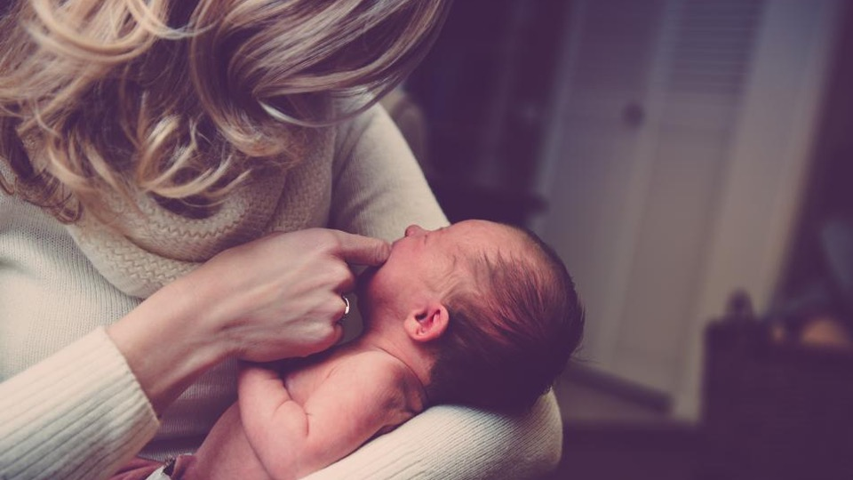

＊本文參考整理自GOLD Lactation 2021, ReLATCHtation: transitioning the Exclusively Bottle-fed Baby to Nursing, by Alyssa Schenell, IBCLC  
    
  如何瓶餵轉親餵一直是母乳社團或媽媽社團裡常常出現的月（？）經文。想讓寶寶重新再回到乳房上的原因很多，有些是厭倦了無限擠奶餵奶洗奶瓶的忙碌迴圈、有些可能因為產後種種因素無法親餵、甚至有些是短暫離乳後發現生活沒有比較好過（笑）而決定重新練習親餵…不管是什麼原因，讓寶寶重新回到乳房上都需要一些時間與方法來適應。  
  
**從瓶餵轉親餵的過程可以大致分成四個階段：**  
    
# 一、重新建立與餵食者*的連結（Ready for loving care）  
有些寶寶一出生就和母親分離（如需住進新生兒加護病房的早產兒），由於環境的限制，這些寶寶在進食的同時無法和餵食者產生足夠的連結。以新生兒加護病房中的寶寶為例，由於喝奶時較無法得到足夠的眼神注視、豐富的肢體接觸、以及適切的餵食工具（如適合的奶瓶奶嘴），這些寶寶較難和餵食者產生連結與依附。因此，可以先讓寶寶與媽媽從充滿愛的交流開始，包括：**讓寶寶環抱在媽媽的手臂中、餵食時將寶寶抱起、多提供寶寶舒適的撫觸、和寶寶接觸時給予穩定的眼神接觸，以及選用適當的奶瓶奶嘴（避免灌食！）**。當寶寶逐漸建立起與媽媽的連結與依附後，就是可以開始準備親餵的時候囉！  
*註：由於美國社會文化多元，提供親餵角色的不一定是母親，也可能是養母、寄養家庭母親或是LGBT族群中的任一角色。因此，課程中講者使用餵食者的稱呼而非母親。   

   

# 二、能夠從乳房上進食（Able to nurse）  
有些寶寶因為生理上的因素而無法順利親餵，常見問題包括：口腔動作功能不足、活動能力受限（肌力或肌張力問題）以及舌/唇繫帶問題。若有上述問題，建議尋求相關專業人員協助，評估問題後提供適當介入，改善寶寶進食功能。   
  
另一方面，媽媽也可能因為缺乏足夠支持、患有情緒相關問題或疾病（如產後憂鬱、曾遭受性侵、或有性別不安等問題）、以及因疾病用藥等原因無法親餵。若有以上困擾，建議媽媽可**多方面尋求支持（如伴侶、家人、專業人員或社區支持團體等），或至母嬰親善的醫療院所接受進一步的醫療照護，在自身狀況及哺乳需求間取得平衡。**  
  
# 三、轉親餵的準備（Prepare for transitioning）  
此階段是我個人認為最需要花時間陪伴與準備，卻也非常關鍵的一個階段。  
此階段的重點為「**讓瓶餵更像親餵**」以及「**增加親餵的接受度**」。
  
+ **瓶餵的寶寶在轉親餵過程中無法適應的可能原因包括：**  
	1. 瓶餵能較不費力地獲得流速快的奶水  
	2. 瓶餵時使用較窄口徑的奶嘴，使得寶寶沒有張大嘴巴進食的習慣  
	3. 使用質地較硬挺的奶嘴，不需用口腔塑形  
	4. 期待吸吮後能馬上得到奶水  
	  
+ **為了減少瓶餵轉親餵的落差，我們可以「讓瓶餵更像親餵」**  
  1. **在瓶餵的同時進行肌膚接觸**：媽媽裸上身，將奶瓶放在與乳房等高的位置進行餵食。  
  2. **採用嬰兒主導式餵食**：選擇小孔洞、流速慢的奶嘴，奶瓶以水平的方式進行餵食。點此進一步閱讀[嬰兒兒主導式餵食方式](https://ptpeiyuyang.netlify.app/blog/2020-05-16-baby-fed-bottle-feeding/)     
  3. **等待寶寶張大嘴後再將奶嘴放入口中**：可先用奶嘴在寶寶人中或嘴唇做刺激，等寶寶嘴巴張大、舌頭出現動作時，再將奶嘴放入寶寶口中。如同親餵時，等寶寶嘴巴張大時再協助含上乳房。
  4. 使用根部形狀較寬的奶嘴，**鼓勵寶寶瓶餵時嘴巴張大**。  
  5. **延遲奶水的給予**：寶寶前幾口吸吮時，不急著將奶水送給寶寶，可將奶瓶斜放（奶水不進到奶嘴中），待寶寶吸了幾口之後再把奶瓶擺成水平。這個步驟目的為，模仿親餵寶寶頭幾口吸吮誘發排乳反應的過程。  
  6. **輪流使用左右手抱寶寶瓶餵**：親餵的寶寶能吃兩邊的乳房，因此瓶餵時，也要讓寶寶習慣在不同方向進食。  
  
  > 增加親餵接受度的四個關鍵為：「重新喚醒親餵的本能」、「創造和乳房的正向連結」、「使用瓶餵以外的替代餵食方式」以及「在乳房上提供流量」  
  
+ **另外，以下方法則是有助於增加寶寶對於親餵的接受度：**    
  1.**重新喚醒親餵的本能**：研究發現，和主要照顧者親密的身體接觸會讓兒童表現出早期的行為模式，因此，可以嘗試利用各種親密接觸的方式喚醒嬰兒的親餵本能，包括：肌膚接觸、安全共眠、共浴、嬰兒按摩等。  
  2. **創造和乳房的正向連結**：讓寶寶在乳房/胸部附近進行喜歡的活動，如進食、玩耍、洗澡、按摩等，讓寶寶更喜歡待在乳房的位置。  
  3. **和寶寶溝通**：把寶寶當成大人一樣溝通，縱使寶寶無法理解文句的意義，也能透過交流或語氣感知大人的意圖。此外，對寶寶說話也有安定媽媽的效果。  
  4. **替代餵食**：杯餵（較適用於進食量少的狀況下）、手指餵食。  
  5. **乳房上提供流量**：可在練習親餵的同時使用哺乳輔助器，讓寶寶願意停留在乳房上較長時間。  
  **提醒讀者，若有使用替代餵食或哺乳輔助器的必要性，務必在執行前尋求醫師或泌乳顧問的協助。**  
    
    
# 四、提供親餵（Offer Nursing）  
這個階段的關鍵在於「讓親餵更像瓶餵」以及「準備親餵的環境」。  

+ **讓親餵更像瓶餵：**  
  1. **立即增強**：在親餵前先手擠乳，誘發排乳反射；親餵的同時在乳房上滴額外的乳汁或配方奶；使用哺乳輔助器。  
  2. **協助乳房/頭塑形**：使用「三明治法」協助含乳及乳房塑形；在親餵前先以機器或手擠數分鐘，讓乳頭較突出可能較有利於含乳；特殊情況下可考慮使用乳頭罩（需同時考慮移除乳頭罩的計畫）。  
  3. **增強流速**：親餵時在乳房上加壓，增加乳汁流速；以主導式方式瓶餵少許後再上乳房親餵；親餵時以餵食管或哺乳輔助器額外提供乳汁。  
    
+ **準備親餵的環境：**  
  1. 選擇讓寶寶較平靜的空間與環境  
  2. 迎合寶寶的喜好：選擇心情較平靜的時間，選擇寶寶喜歡的親餵姿勢  
  3. 持續和寶寶說話  
  4. 持續執行和寶寶的親密接觸（肌膚接觸、安全共眠與共浴等）  
  5. 不要在過於飢餓的時候才親餵：了解飢餓暗示、親餵前先瓶餵少量  
    
以上要點都有助於協助瓶餵寶寶轉親餵。然而，每個寶寶都是獨一無二的個體，不一定都照著同樣的進度前進。因此，在練習親餵的同時，別忘了**觀察寶寶的反應，耐心的陪伴寶寶練習，並多給寶寶鼓勵與正向回饋**。遇到瓶頸或卡關的時候，別忘了**適時地尋求協助與支持**，相信每對母嬰終能找到雙方都接受且享受的親餵時光。

  

    
