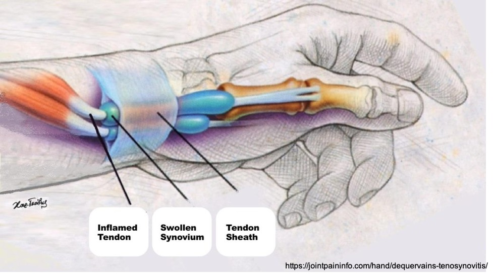
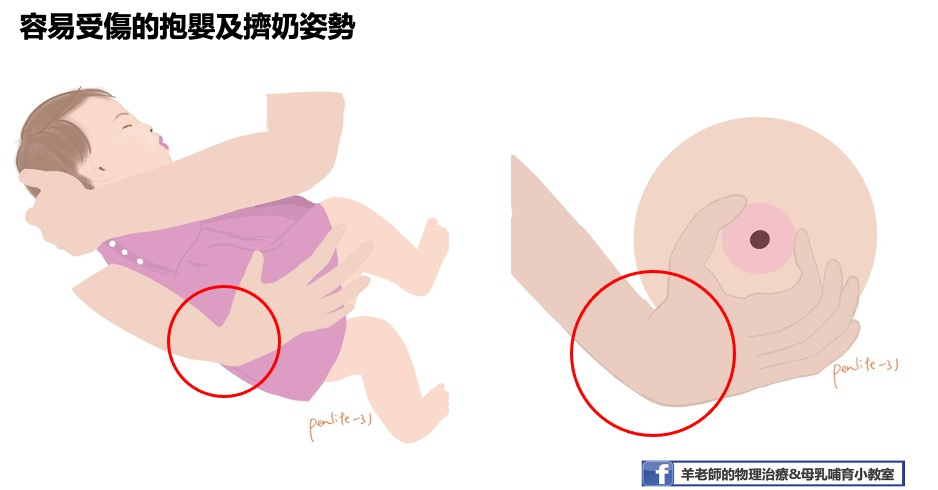
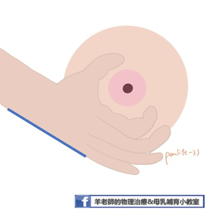
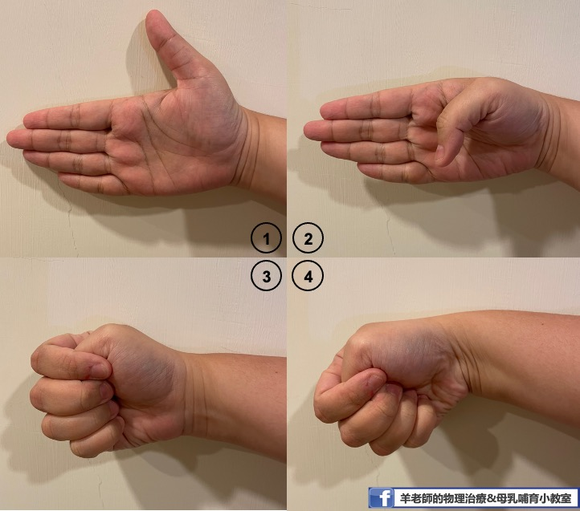
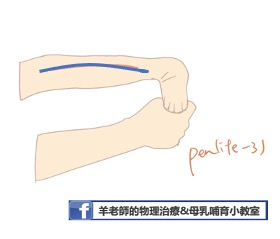
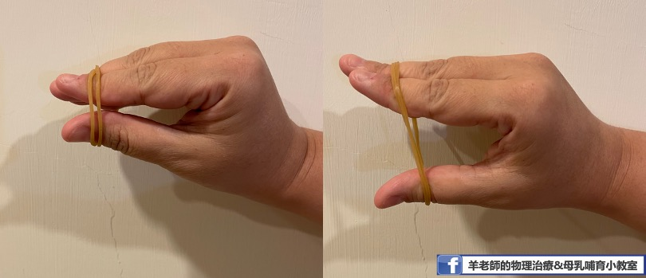
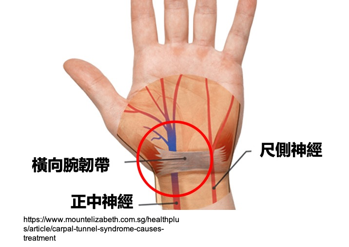
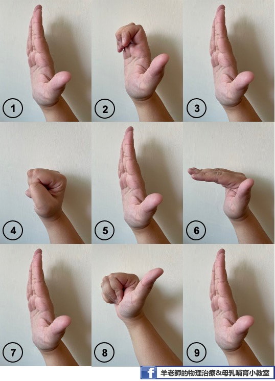

  
  媽媽真的是世界上最偉大也最辛苦的職業！  
  在物理治療門診常常見到各式各樣關於媽媽的「職業災害」，看著媽媽們這裡疼、那裡痛，卻還是一邊做治療一邊繼續日常的工作，除了心疼也是不捨。其實，很多「媽媽職災」都跟姿勢以及用力不當有關，適當調整的話，疼痛是可以預防的喔！以下就媽媽手、腕隧道症候群、肩背疼痛以及網球肘等四大常見傷害分別介紹，一起來了解吧！  
  
**提醒您：若有任何疼痛不適，請務必就醫接受診斷及治療，找到根本原因後，再搭配本文進行居家運動，才能真正解決疼痛問題喔！**  
  
# 媽媽手  

   

媽媽手在醫學上的全名為「狄奎凡氏症」，主要是**生活中過度使用大拇指所造成的肌腱及滑膜傷害**，患者通常會有手腕拇指側的疼痛、腫脹或手腕無法使力的現象，疼痛的症狀可能會在手指手腕用力的時候特別明顯，如擰毛巾、拿杯子、擠奶等動作。過去媽媽手常好發於家庭主婦或剛生產完之婦女，然而現代人由於3C產品使用時間大增，握滑鼠、滑手機等動作都容易引發媽媽手問題，使媽媽手不再是媽媽的專利！
要預防媽媽手，我們可以從三件方向著手：**調整姿勢、伸展運動以及肌力強化**。  
  
**調整姿勢**  

新手媽媽常常因為抱孩子以及擠奶姿勢不正確而引發媽媽手。要預防媽媽手，最重要的是在手部施力時，盡可能保持**手腕與手臂一直線**（不讓手腕有太大的凹折角度）、拇指不過度伸張，並善用周邊物品分散重量。  
   

執行手擠奶時，注意不聳肩，手腕手臂保持一直線，大拇指與食指呈C字型，猶如蓋印章般的對指按壓即可，切勿在乳房上用力搓揉、摩擦。若需按壓不同角度，可適時用對側手協助，勿使手腕角度過於凹折。若想增加奶量的媽媽，建議增加擠奶頻率，讓每次每邊擠奶介於10-15分鐘即可，如此才能有效地衝奶量又不造成自身的傷害。  
  
   

抱寶寶時，媽媽常會用自己的手掌托著寶寶的屁股、大拇指與其他四指分開，而使手腕、拇指在壓力過大的角度施力造成受傷。提醒媽媽們，要預防媽媽手，在抱寶寶時記得將五指併攏，並善用手邊的枕頭、背巾等物品，協助支托寶寶的重量；若真的需要抱起寶寶時，也盡量讓寶寶靠近自己，減少力臂，降低手指手腕的壓力。
    

**伸展運動**    
  
若您已是媽媽手患者，除了接受物理治療外，也可加上適度的拇指肌腱與手腕肌肉伸展運動，如此可減緩症狀的不適。    

+ **拇指肌腱伸展運動方法**  

  1. 將手輕鬆放在身體前方，大拇指朝天花板方向。  
  2. 大拇指彎曲，放進手掌中，接著將其他四指彎曲，包覆著大拇指做握拳動作。  
  3. 將手腕輕輕往地板方向帶，動作要緩慢，停在覺得緊繃的角度並維持10秒，然後回到原位。伸展的過程中應該只會有緊繃的感覺，不應感覺到疼痛。    
  4. 拇指肌腱伸展運動，每日可做3回，每回10下，每下停留10秒。    
  
     
    
+ **手腕肌肉伸展方法**     

【**手腕手指屈肌伸展**】  
  1. 將手肘打直，往前伸至身體前方，手掌面向天花板。  
  2. 另一手抓住患側手的四指，將手指往身體方向帶（手掌面向前方），感覺前臂內側有緊繃的感覺即可，不應出現疼痛感。  
  3. 維持10秒，然後回到原位。  
  
【**手腕、手指伸肌伸展**】  
  1. 將手肘打直，往前伸至身體前方，手掌面向地板。  
  2. 另一手抓住患側手的手背，將手往身體方向帶（手掌面向自己），感覺前臂外側有緊繃的感覺即可，不應出現疼痛感。  
  3. 維持10秒，然後回到原位。  
  
   
  
**肌力強化**    
  在脫離急性期後（用力時不再感到疼痛），即可開始做肌力強化運動。    

+ **拇指外展肌力強化**  

  1. 手指略為張開，拿一條橡皮筋圈住五隻指頭。  
  2. 大拇指用力和其他四指分開，感覺拇指肌肉有出力的感覺，停留5秒鐘之後再慢慢回到原位。  
  3. 一天3回，每回10下。  
  4. 若感覺單一條橡皮筋過於簡單，可增加至2-3條橡皮筋，增加阻力。若練習時引發疼痛，則表示橡皮筋提供的阻力過強，建議減輕阻力再做。  
  
    
 
+ **握力訓練**  
  1. 可使用毛巾卷或海綿球，用力抓緊到凹陷，感覺手指皆有出力，維持5秒。之後放鬆回到原位。  
  2. 一天3回，每回10下。  
  3. 若覺得抓握毛巾卷或海綿球過於簡單，也可選擇市售的握力器。  
  **建議先請物理治療師評估建議重量後再行購買，以免再度受傷。**  
  
 
# 腕隧道症候群  
在我們的手腕內側，有一條橫向的韌帶與腕骨形成一個如隧道一般的結構，隧道的中間有正中神經穿過。懷孕期的婦女可能因為賀爾蒙改變，造成橫向韌帶腫脹壓迫到正中神經產生症狀；而新手媽媽，也可能因為長時間以不正確的姿勢抱寶寶或擠奶等，造成**正中神經的壓迫**。  
腕隧道症候群的症狀包括手麻、無力、疼痛等神經性症狀，手麻及疼痛的症狀可能會在夜間更加明顯。  

    
 
 要預防腕隧道症候群，最好的方法就是**讓手腕處在自然姿勢**（**腕部不過度屈曲、伸展，手腕和手臂呈一直線**）。此外，採用**正確的施力方式、避免長時間的手部運動、減少手部的負重**都可以預防腕隧道症候群的發生。姿勢的調整可參考上方媽媽手的姿勢調整方法。若疼痛持續，可考慮使用手腕護具、副木等讓手腕休息。保守治療無效則須考慮手術治療。  
 
    
 
**掌部肌腱滑動運動**可促使腕部肌腱在腕隧道中的滑動更順暢，減少肌腱沾黏。  

   
 
 下一篇，我們將繼續談談，網球肘與頸背酸痛問題。  
  
推薦書目：物理治療師教你自助擺平痠痛（大塊文化）

 

