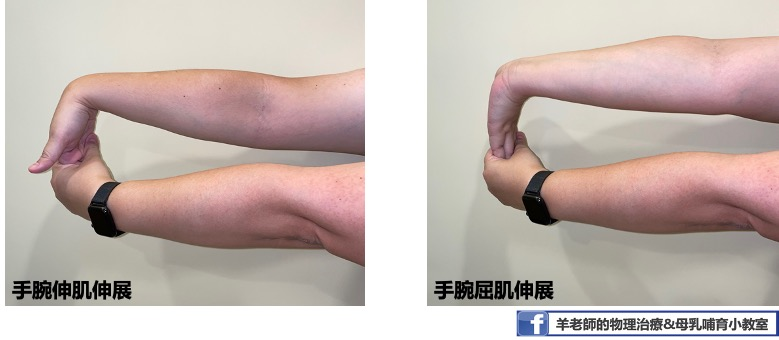

上篇文章中，我們介紹了媽媽手以及腕隧道症候群。這篇文章，我們將繼續介紹「**網球肘**」以及「**頸背部酸痛**」。  
  
**提醒您：若有任何疼痛不適，請務必就醫接受診斷及治療，找到根本原因後，再搭配本文進行居家運動，才能真正解決疼痛問題喔！**   

# 網球肘  

  
  
網球肘的正式醫學名稱為「肱骨上髁炎」，由於許多網球選手若擊球時的姿勢不當，容易造成手肘外側肌腱發炎疼痛，所以也稱作網球肘，是很常見的運動傷害。  
  
看到這裡，或許您會有疑問，「*我根本不會打網球，怎麼會得網球肘？*」  
  
事實上，很多得到網球肘的人從來沒打過網球。網球肘主要是由於**長期使用手肘、手腕從事持續性肌肉負荷、高度重複性的工作，使得手肘產生急性或慢性肌腱發炎的現象**。因此家庭主婦（洗滌煮飯等家務）、常常抱小孩的媽媽（長時間在手肘彎曲下負重）、從事羽球、網球或高爾夫球運動、長時間重複使用滑鼠的電腦族、木工、水電工等族群也都是網球肘的好發族群。  
網球肘的症狀主要為用力、提重物時手肘處會疼痛、無力；甚至肘關節外側可能因發炎有發熱腫脹的狀況。  

要預防網球肘，最好的方式就是**減少重複性的使用手肘手腕**。比如說出門買東西提重物的時候，可改用推車取代將袋子勾在手臂上、善用背巾取代手抱孩子，都是日常生活中可改善的方式。若是真的不可避免地需要出力，則可在用力過後適當地做些伸展運動，以及肌力強化的動作，減少肌腱受傷發炎的機會。  

**伸展運動**  
+ **手腕屈肌伸展**  
  1. 將手肘打直，往前伸至身體前方，手掌面向天花板。  
  2. 另一手抓住患側手的四指，將手指往身體方向帶（手掌面向前方），感覺前臂內側有緊繃的感覺即可，不應出現疼痛感。  
  3. 維持10秒，然後回到原位。  
  
+ **手腕伸肌伸展**  
  1. 將手肘打直，往前伸至身體前方，手掌面向地板。  
  2. 另一手抓住患側手的手背，將手往身體方向帶（手掌面向自己），感覺前臂外側有緊繃的感覺即可，不應出現疼痛感。  
  3. 維持10秒，然後回到原位。  
  
  

**手腕及前臂肌力訓練**  
若已經脫離疼痛的急性期，休息時不會感到疼痛，則可以開始漸進式的進行肌力訓練。  
  1. 手臂靠在桌上，手拿水瓶、沙包或啞鈴，手腕稍微垂出桌外。  
  2. 慢慢將手腕上抬，停5-10秒後再慢慢放下。上抬和放下的動作務必緩慢。  
  3. 若一開始拿著水瓶或沙包練習感覺吃力或引發疼痛，可先從不拿重物開始，之後再慢慢增加重量。  
  4. 一回10下，每日3回。  
  
      

**手腕肌腱的深層按摩**    
  1. 患側手臂放鬆，另一手大拇指在手肘外側肌肉處下壓（可能會有些微痠痠的感覺）。或可使用手機、遙控器的鈍角進行。  
  2. 左右方向的進行深層肌肉按摩，可讓肌肉適度放鬆。注意不要在皮膚上磨擦！  
  
        
  
# 頸背部疼痛  
現代人由於多半是久坐不動的生活型態，因此頸背部疼痛可說是大家最熟悉的骨骼肌肉不適。而需要哺乳、擠奶或長時間抱嬰的新手媽媽，更是常常因為姿勢不良造成疼痛。  
除了放鬆按摩之外，每日的伸展運動也可以有效的預防長時間累積的疼痛喔！  
  
**調整姿勢**  
媽媽在哺乳時，有時會遷就孩子的姿勢，而讓自己的脊椎承受過多的壓力。常見的NG姿勢包括，餵奶時腰部懸空、長時間低頭看孩子以及手抱著孩子沒有支托等。  
事實上，媽媽先把自己調整到舒服的姿勢了再開始哺乳，有助於催產素的釋放；而且媽媽越舒服放鬆，寶寶的吃奶表現也會越好喔！所以，餵飽孩子前，先讓自己舒服吧！  
  
 
  
採坐姿搖籃式哺乳時，記得**找一個有靠背及扶手的沙發或椅子，椅子的深度最好能剛好支托到膝窩處，若椅子太深或腰部容易懸空，則可用靠枕或毛巾卷將空隙處塞滿**。腳下可以踩一個高度剛好的小凳子，減少腰部的壓力。腿上放好哺乳枕後再將寶寶抱至身上，**寶寶的重量應由哺乳枕來支托**，媽媽的手主要負責固定好寶寶的頸部即可。支托良好時，媽媽應該是可以將雙手都放開而寶寶能夠穩定的躺在哺乳枕上。若哺乳枕高度不夠時，可在哺乳枕的下方再墊個小被子或毛巾，盡量不要用自己的大腿「撐」著哺乳枕。  
新手媽媽可能會想要一直觀察寶寶是否吃得好，所以會長時間低頭，如此一來，可能造成頸部後側肌肉緊繃疼痛，嚴重的話甚至可能造成頸椎的椎間盤突出。建議媽媽不時的提醒自己將頭頸的位置回到自然姿勢，若想觀察寶寶的狀況，也可以在前方放一面全身鏡協助觀察喔！  
  

**伸展運動**  
+ **頸部後側伸展運動**  
  1. 坐在有靠背的椅子上，讓身體得到良好的支托。  
  2. 下巴略為後收，並將雙手交握輕放在後腦勺的位置，雙眼往下看著地面。  
  3. 兩手將頭輕輕往下帶，感覺頸部後側有繃緊的感覺，停留10秒鐘。**注意保持呼吸順暢**    
  4. 回復原來姿勢休息，之後再進行下一次。  
  5. 每回10下，每天3回。  
  
  
  
+ **頸部側邊伸展運動**  
  1. 坐在有靠背的椅子上，挺胸收下巴。  
  2. 以伸展右側肌肉為例，先將右手扣住椅子的邊緣，左手繞過頭部上方摸到右側耳朵。  
  3. 左手輕輕將頭部往左邊帶，讓左側耳朵靠近左側肩膀，此時會感覺右側頸部肌肉有緊繃感。此時不應有疼痛！**注意保持呼吸順暢**      
  4. 停留10秒，之後恢復到原來姿勢休息。  
  5. 每回10下，一天3回。  
  
  

+ **牆角伸展運動**  
牆角運動的主要目的是放鬆胸肌。由於姿勢不良多半伴隨著駝背的姿勢，使得前側胸肌緊繃，進而造成肩背部肌肉痠痛。因此，放鬆胸肌也可改善頸背部肌肉僵硬的問題。  
  1. 找一個安全的牆角，面向牆角站弓箭步，兩手各放在一面牆上，前臂貼緊牆面，手肘稍微高於肩膀。  
  2. 前膝微彎，將身體往前帶向牆角，此時會感覺前胸及肩膀有伸展緊繃的感覺。  
  3. 停留10秒，之後再回到原位休息。  
  4. 重複10次，一天3回。  
  
  
  
+ **下背部伸展運動**  
  1. 躺在軟墊上，屈膝，手抱大腿後側。  
  2. 將膝蓋慢慢的往胸口方向帶，到後背有微微緊繃的感覺即可。保持呼吸順暢，維持10秒鐘之後放鬆回到原位。  
    
  
  
除了伸展運動之外，平時記得多收小腹，或做一些核心肌力訓練，都有助於增加脊椎的穩定，減少背部疼痛問題。  
  
以上都是針對常見痠痛問題，平時能做的居家伸展及肌力強化運動。  
**還是要提醒大家，如果真的有疼痛不適，還是要到醫療院所就醫，找到真正的原因，再配合治療，才能真正地跟疼痛說掰掰喔**！  

 
