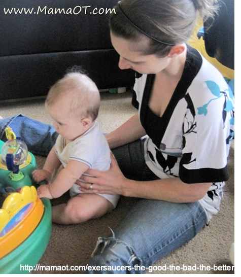
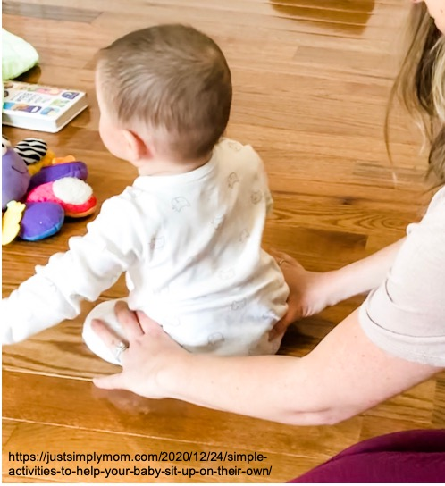

物理治療師在評估嬰幼兒的粗大動作發展時，會根據孩子在不同姿勢下的活動能力來判斷發展狀況，可大致分為躺姿、趴姿、坐姿、以及站姿。「七坐八爬」相信是大家都不陌生的嬰兒發展里程碑。事實上，**嬰兒的粗大動作發展是一連串的過程，與嬰兒的神經成熟度以及肌肉動作控制能力相關**，很難單純用時間點去界定，也並不是一定要會坐了才能進階到爬。  
  
近年來，由於大家對於Tummy time 的重視，越來越多家長認知到應該讓孩子多趴著玩，這是一個好現象！然而，在做發展評估時卻也發現另一個有趣的現象：有些寶寶在趴姿下的能力超強，可以用手掌撐地趴、可以肚子貼地轉圈圈、甚至可以一手手肘撐地另一手伸出來玩玩具，但是被擺到坐姿下時，整個身體軟趴趴，若大人沒有給予支撐就完全無法維持姿勢。通常再深入問下去，會發現這些寶寶在家多半都是趴著玩，很少有機會採取直立姿勢玩耍，就算有，也多半是緊靠著大人身體坐。當然偶爾也會聽到一些「*太早坐對小孩脊椎不好、容易脊椎側彎*」等等的都市傳說……事實上，**目前並沒有證據顯示讓寶寶練習坐會影響脊椎形狀**。   
  
# 直立姿勢的好處  
直立姿勢可以改變寶寶的視覺刺激型態、得到不同於水平姿勢的本體感覺刺激（所謂的本體感覺就是不用眼睛看就能感知到身體位置及活動的能力，例如：本體感覺正常的人閉著眼睛也能夠摸到自己的鼻子、閉著眼睛也能知道自己處於坐著還是站著的姿勢），也有人發現當寶寶能夠獨坐或站立時，得到的語言刺激也會大不相同！而能夠獨立坐穩的寶寶，由於能夠更隨心所欲地釋放雙手玩耍，因此探索的機會增加，更能夠藉由操作來感受物品的質地及形狀，使得物品操作能力增加，空間概念也更好！此外，也有研究發現，早產兒獨坐的能力和日後的語言及認知發展相關。因此，**提供適度的坐姿練習，對寶寶的發展也有一定的重要性**。  
  
# 要怎麼開始坐姿練習呢？  
前面我們提到，練習坐著對脊椎並不會有不良影響，但是「怎麼坐」對不同月齡或發展能力的孩子卻是大不相同，其**關鍵在於寶寶對於軀幹的控制能力**。剛具備頭部控制能力的寶寶，如果抱直時頭部可以穩定不搖晃，則家長可以將雙手支撐寶寶腋下，讓寶寶坐著看東西或玩玩具；當寶寶越來越有力氣，就可以試著把支撐寶寶的手往下到肚子、骨盆，之後再慢慢放手，增加寶寶坐立的困難度。如同趴著玩一樣，動機對寶寶練習出力很重要，因此練習坐姿時也要記得提供寶寶有興趣的玩具或物品在前方吸引寶寶注意，也可以利用前方物品的高低增加坐姿的困難度喔！  

  
    
  
練習坐著玩的場地也很重要，通常建議在地墊上練習，軟硬較為適中。若真的坐不穩跌倒，也不致於造成太嚴重的傷害。當然，**在寶寶能自己坐得穩之前，大人一定要在旁邊陪伴，絕對不要讓寶寶自己坐著，以免發生危險**！此外，讓寶寶坐在餐椅或幫寶椅內，由於寶寶不太需要自己出力氣，對軀幹控制能力幫助有限，因此這樣的做法也不適合取代坐姿練習！  
  
孩子的發展是在遊戲中產生，對於一般孩子而言，只要提供適當的環境刺激，孩子自然而然能夠發展出相對應的能力，過度的限制反而會影響孩子發展。**若發現孩子可能有發展上的問題時，還是建議進一步尋求專業評估與建議，才能儘早發現問題，把握發展黃金期**！  

