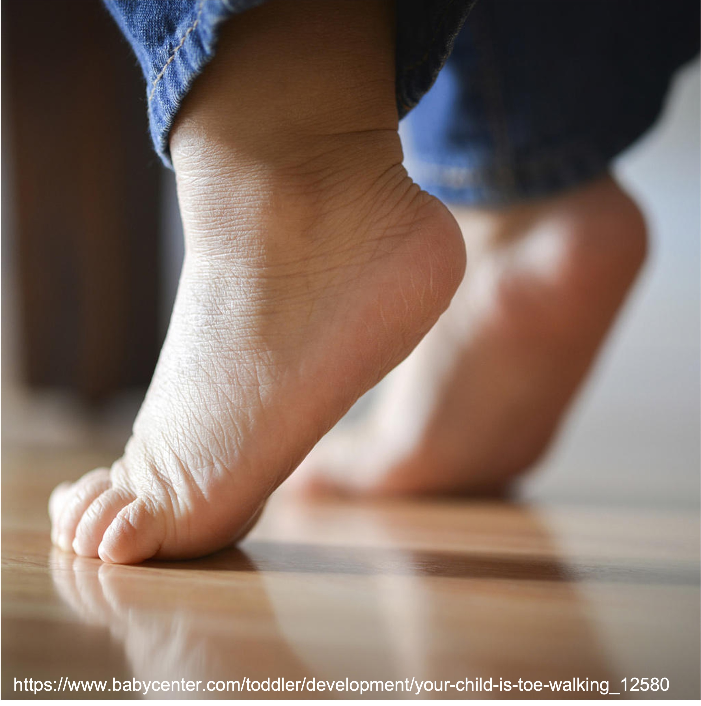
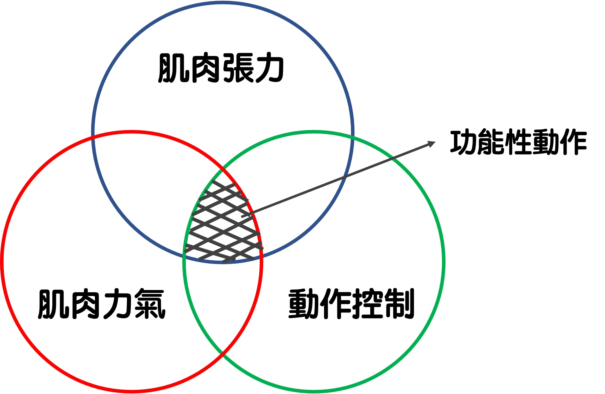

常有帶著孩子前來評估的家長很擔心地問我，「*醫生說我的寶寶低張，該怎麼辦？*」或是「*寶寶有低張，長大會自己好嗎？*」  
資訊量爆炸的現在，只要在搜尋引擎打上「張力異常」就會出現上百萬筆的資料，但是家長多半在看完一篇又一篇的文章後，對於張力到底是什麼，仍然一頭霧水，甚至越看越擔心……  
  
# 肌肉張力與肌肉力氣  
從定義上來看，**肌肉張力 (muscle tone) 指的是肌肉處於休息狀態下，面對被動牽拉時所產生的阻力**；也可以說是肌肉本身的彈性。因此，當我們在評估肌肉張力時，通常會要求受測者放鬆不要出力。  
**肌肉力量(muscle power)則指的是肌肉對抗某種阻力（地心引力也是一種阻力）所發出的力**。評估時會給予受測者一個阻力，請受測者盡可能出力對抗。  
當然，肌肉本身也是一個複雜的組織，其他太過生澀的生理機轉我們今天暫且先不談。  
看到這裡，您可能還是一頭霧水，到底肌肉張力跟肌肉力氣有什麼不一樣？  
沒關係，讓我用橡皮筋與包便當來比喻給您聽。  
  
想像您手上拿著兩條鬆緊不同的橡皮筋，一條很緊很難拉開，一條很鬆不用太大力就可以將其撐開。橡皮筋就是我們的肌肉，而這個鬆或緊，就是所謂的肌肉張力。  
  
  > 肌肉張力可以看做是肌肉本身的彈性。  
  
當我們今天希望肢體做出一個動作時，就像橡皮筋被賦予包便當的任務一樣。如果拿到比較鬆的橡皮筋，可能需要多繞兩圈才能把便當盒綁好不會鬆開，也有可能繞了好幾圈還是綁不緊。這就像是低張力的寶寶，要做出一個動作可能需要比張力正常的寶寶花上多一點力氣，也有可能出了很多力但還是做不到同樣的動作，甚至因為出錯力反而出現其他的代償機制。  
  
反之，如果拿到比較緊的橡皮筋，可能稍微拉開就能綁好便當盒，也有可能橡皮筋太緊反而讓便當盒扭曲變形。這就像是高張力的寶寶，在某些狀況下可以藉著張力就簡單做出一些動作，但是也可能受到張力的影響，讓動作的型態看起來怪怪的。  
最常見的例子就是高張力寶寶的踮腳尖步態。由於張力的影響，高張力寶寶可能很早就可以利用張力站起來，但如果缺乏控制能力，或是張力強過自己的肌肉力量可以控制的程度，就會使得每一次站立或行走時都使用踮腳尖的方式在動作。  
  

  
事實上，產生一個動作，需要**肌肉張力、肌肉力量、與動作控制三者共同協調合作**。  
   
  
每個人的肌肉張力都略有不同，肌肉張力也不像肌肉力氣能夠測量出一個客觀的絕對值。**從物理治療師的角度來看，只要能產生具有功能性的動作（比方說步態正常的行走），那麼肌肉張力高低造成的影響就不大**。  
然而，臨床上確實有些寶寶因為肌肉張力的問題，使得早期的動作發展較一般張力寶寶來得困難。這些寶寶容易出現怎樣的表現呢？從物理治療師的角度又要怎麼看待及處理這樣的張力問題呢？我們留待下篇再談。  

