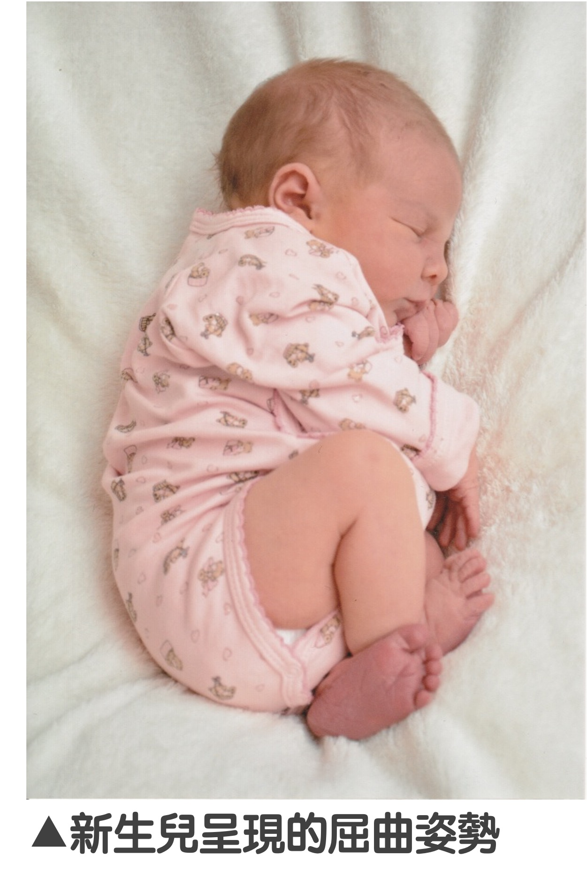

在前一篇中，我們用了橡皮筋與便當盒的概念解釋了什麼是[肌肉張力](https://ptpeiyuyang.netlify.app/blog/2021-10-01-muscle-tone/)，以及肌肉張力和動作表現之間的關係。今天我們來談談，低張力寶寶常會有的表現以及物理治療介入策略。  
  
# 嬰兒的肌肉張力發展  
在胎兒及新生兒的神經發育過程中，肌肉張力並非一成不變。以早產兒而言，在滿40週足月前，寶寶的張力是從腳到頭的方向發展出來的。舉例來說，一個28週出生的寶寶，剛開始四肢可能呈現癱軟狀態，隨著週數越長越大，先是腳會能夠維持彎曲，然後接著手臂也能夠維持彎曲姿勢擺放在胸前，變成和足月新生兒同樣的屈曲姿勢。而到了足月之後的張力發展就和一般足月新生兒相同，原則上是從頭到腳的方向發展，因此寶寶的頸部張力會先出現，然後才是軀幹張力；而這時寶寶的屈曲張力也會慢慢下降，不會再像新生兒那樣「捲」在一起。  
  
  
    

# 低張力寶寶的原因  
造成寶寶低張力的原因很多，除了上面提到的早產之外，其他包括中樞或周邊神經系統異常、神經肌肉病變、代謝性疾病、內分泌問題、營養問題、染色體異常等疾病都有可能會造成寶寶低張力。因此，**若發現寶寶張力異常，最重要的是帶寶寶至醫療院所檢查，找出可能的致病原因進而接受治療**。然而，臨床上除了與上述疾病相關的低張力之外，也有一部分寶寶的低張力是找不到原因的。  
    
    
# 低張力寶寶的表現  
低張力寶寶會有一些常見的臨床表現。包括肌肉力氣低下（全身軟軟的感覺沒力氣）、關節活動度過大（常見的包括手肘過度伸直、膝蓋後頂等）、肌肉延展度高（柔軟度很好，就像上一篇談到的橡皮筋鬆弛的概念）、動作發展遲緩、喜歡倚靠支撐物（俗話說能躺就不站，能躺就不坐，站著時也常常靠東靠西沒站相），而對於一些學齡期的孩子，也容易有活動耐受力低（玩遊戲的時候跑沒兩下就不想玩了）、以及專注力不足及學習動機低下等問題。  
  
# 物理治療對低張力寶寶的介入策略  
在前一篇我們提到，**要產生一個動作，需要肌肉張力、肌肉力氣以及動作控制三個要素共同協調合作**。因此，對肌肉張力低的寶寶來說，同樣要做出翻身的動作，肌肉張力正常的寶寶可能只要花50%力氣，而對低張力寶寶則可能需要出到80%的力（所以可以理解，為什麼張力會影響孩子的發展甚至活動耐受力了吧……要動起來是很累人的呀！）。    
  
  > 物理治療師給予的介入重點在於**肌力強化**以及**增加身體穩定性**兩大面向。  

+ **肌力強化**    
低張力寶寶需要比別人更多的力氣才能做到一樣的動作，因此肌肉力氣的大小對他們的動作表現就至關重要。肌肉力氣的養成不容易，需要時間以及持之以恆的反覆練習，但低張力寶寶當力氣越好，在動作上就會越輕鬆，動作發展與表現也會越好。  
  
+ **增加身體穩定性**  
另一重點在於增加身體穩定性。人體的穩定也是需要肌肉持續出力才能維持，因此對於低張力寶寶來說，要維持身體穩定也較一般人困難（所以才會有東西就想靠著…）。因此，在寶寶還沒能夠維持好身體的穩定之前，不妨從外部多給寶寶一些支撐，讓寶寶能循序漸近發展出良好的身體姿勢與動作。  
舉例來說，當寶寶坐在地墊上玩時，可能因為不容易維持穩定坐姿使得操作玩具困難，這時我們可以選擇讓寶寶先坐在固定良好的幫寶椅內，也可以讓大人用手稍微扶著幫忙穩定寶寶的身體，再讓寶寶進行玩具的操作。如此一來，可以增加寶寶遊戲的品質，也可以讓寶寶更願意在坐姿下玩耍。  
此外，低張力寶寶在開始行走時，也可能因為足部肌肉張力不足，使得走路步態看起來和一般孩子不太相同。除了需要持續訓練力氣之外，一雙穩定性好、足跟包覆度足夠的鞋子，也能夠幫助孩子增加足部的穩定性。  
  
**低張力寶寶可能面臨發展上的困難，需要父母與專業人員的支持與協助**。千萬不要覺得孩子只是懶，長大就會好。把握黃金期進行早期介入，才能讓孩子的發展更順利。

