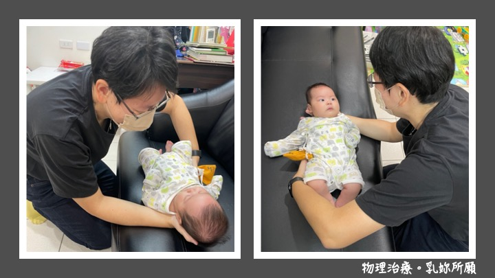
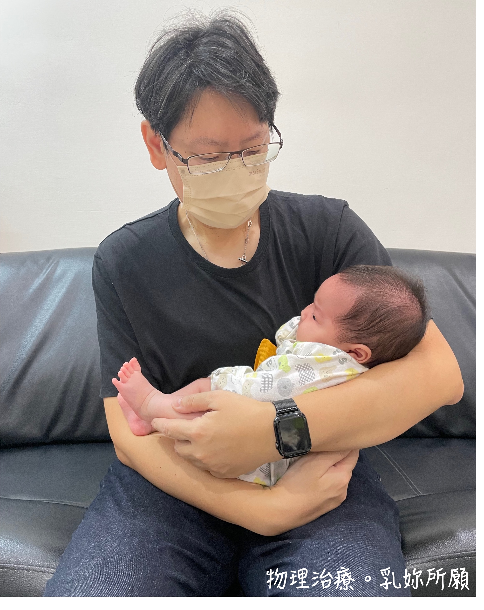
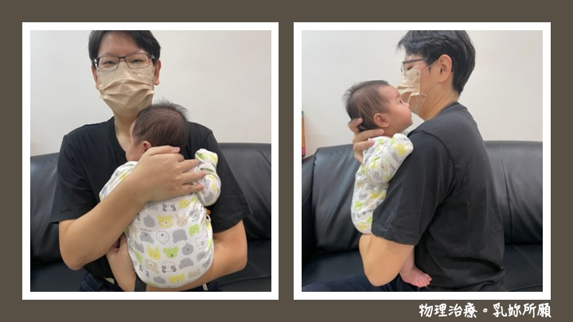
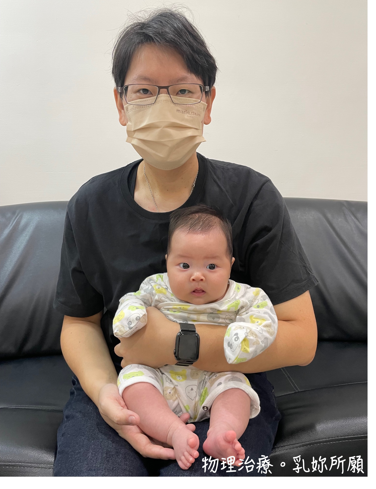
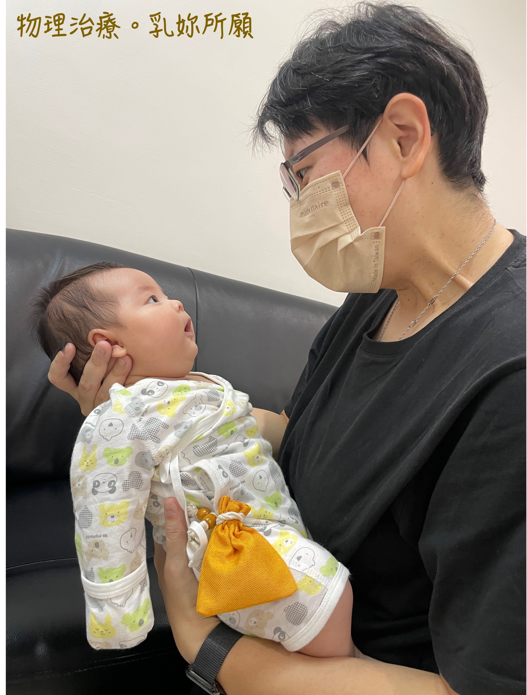

當孩子出生，從溫暖且包覆性極佳的子宮內離開，無限制的肌膚接觸是最能夠安撫孩子、讓孩子穩定下來，並給孩子最大安全感的方式之一。有許多研究發現，透過擁抱給予孩子好的觸覺刺激，能夠**促進孩子腦部發育**、**幫助孩子穩定生長**、**協助安撫孩子情緒以及降低壓力反應**。擁抱，也是建立良好親子關係與互動最簡單的方式。然而，剛出生的新生兒看起來很脆弱，脖子也軟趴趴的，許多新手爸媽即使很想把孩子抱好抱滿，卻也擔心是否會因為抱的方式不對而傷害到孩子。  
  
  > 擁抱，是建立良好親子關係與互動最簡單的方式之一  
  
以下分別介紹幾種0~3個月嬰兒的攜抱方式與好處，讓我們一起「抱」出孩子的好發展吧！  
  
小提醒：3個月內的新生兒，通常頭部控制能力還不穩定，脖子還軟軟的，因此會**建議家長抱孩子時，務必保護孩子的頸背部，避免晃動過大而造成傷害**。另外，此時期的寶寶，身體自然會因為屈曲張力而彎彎的，因此在抱寶寶的時候，也建議讓軀幹呈現**屈曲姿勢**喔！  
  
# 從床上抱起
要把寶寶從床上抱起時，大人一手先穿過寶寶脖子後方，虎口打開托住孩子頭頸部，讓寶寶脖子和上背部能安穩的躺在大人的手掌上。而另一手則托住寶寶的屁股，就能把寶寶安全的抱起來了。  
  

*小秘訣1：建議大人的兩隻手分別從孩子的兩側做支托，寶寶被抱起時會更安全。通常會讓托住脖子的手靠近大人身體，而從寶寶的外側支托屁股。*  
*小秘訣2：若寶寶所在的平面較低，建議大人蹲下來靠近寶寶，先將寶寶抱靠近自己的身體後，再藉由膝蓋大腿力量站起。盡量避免彎腰把寶寶「撈」起，否則容易對大人的腰椎產生過大壓力而受傷。*  
  
# 搖籃抱姿
這個方式是最常見的抱寶寶姿勢，能給寶寶最大的支托，大人也能輕易地和懷中的寶寶互動。要特別提醒家長，用這個姿勢抱寶寶時，除了要支托好寶寶的頭頸部外，最好**讓寶寶的軀幹呈現微微彎曲的屈曲姿勢**。另外，也記得要**將寶寶的雙手帶到自己身體前方**來喔！  
    
  
# 直立抱姿  
某些時刻當寶寶不適合用搖籃抱姿時（通常是剛吃飽），也可以選擇使用直立抱姿。直立抱姿除了能利用重力，讓剛吃飽的寶寶比較不容易溢奶之外，也可以**提供寶寶較豐富的視覺刺激**。若寶寶已經有一點點頭控能力，可稍稍把頭從大人胸口抬起，大人不妨把保護寶寶頸背部的手稍微放鬆一點點（但不可完全放開），也是讓寶寶練習抬頭的好機會喔！同樣的，在這個姿勢下，我們也盡量讓寶寶的軀幹呈現屈曲姿勢，因此寶寶比較像是大腿跨開的「坐」在大人手臂上，如此一來可以讓寶寶有良好的髖關節發育，也可以讓寶寶下半身保持屈曲。  
   
  
# 面朝前的直立抱姿
對於某些已經有部分頭部控制能力的寶寶，可採用面部朝前的直立抱姿，增加寶寶對環境的探索機會，也可以延長寶寶出力抬頭的時間。採用這個抱姿時，會讓寶寶的背部緊靠著大人身體，大人一手穿過寶寶腋下，固定寶寶胸口。若大人坐著，空出的另一隻手可以拿玩具或物品吸引寶寶注意，跟寶寶互動；若希望以此抱姿帶寶寶散步，則空出的手可直接支托住寶寶屁股大腿，讓寶寶坐在手臂上即可。  
**小叮嚀：若在這個姿勢下，寶寶的頭無法自行抬起直視前方，則不適用這個抱姿。**  
     
  
# 面對面互動
0-3個月的寶寶雖然還沒有動手玩的能力，但這時期的他們已經可以用視覺探索環境了！在寶寶清醒的時候，大人不妨將寶寶抱至面前，和寶寶面對面說話、唱歌，給予寶寶豐富的眼神接觸，大人也可以不時的移動自己的角度，讓寶寶有機會練習追視。  
    
    
      
      
喜歡抱抱是寶寶的天性，就連是大人的我們，也喜歡被擁抱著的感覺。研究證實擁抱對寶寶有諸多好處，對寶寶發展也有正向影響。想抱寶寶的時候不要猶豫，就放心抱吧！  

